## AWS EKS 环境准备

### 创建集群

1. 在 AWS EKS 中添加一个新的测试集群

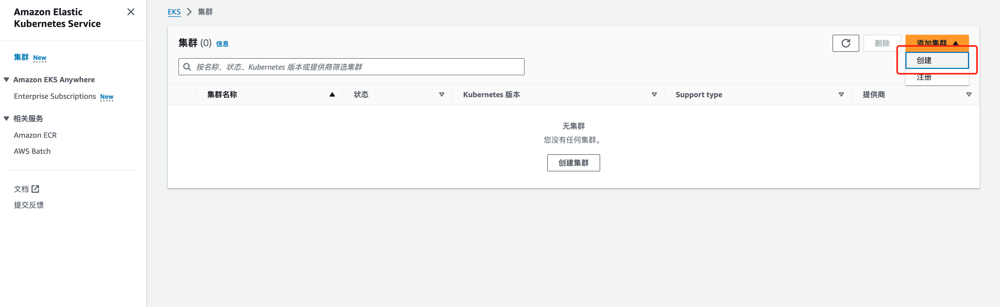

1. 配置测试集群，如果之前没有使用过 EKS 服务配置过集群服务角色，可以根据文档创建一个 EKS 集群角色：[https://docs.aws.amazon.com/eks/latest/userguide/service_IAM_role.html#create-service-role](https://docs.aws.amazon.com/eks/latest/userguide/service_IAM_role.html#create-service-role)

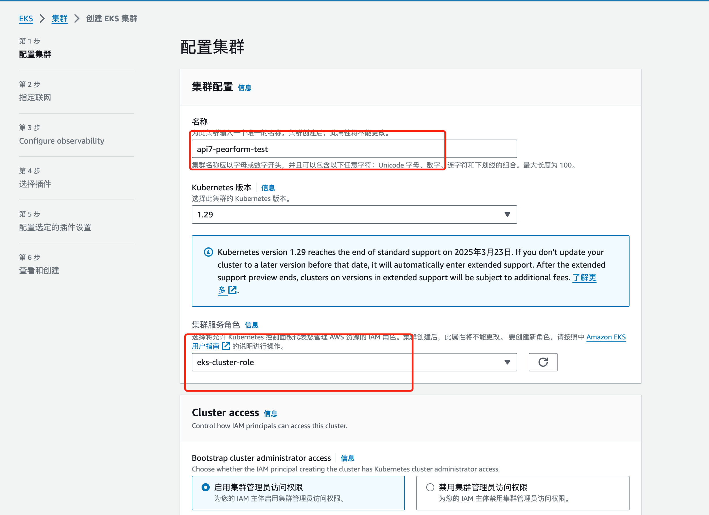

1. 点击下一步配置网络设置

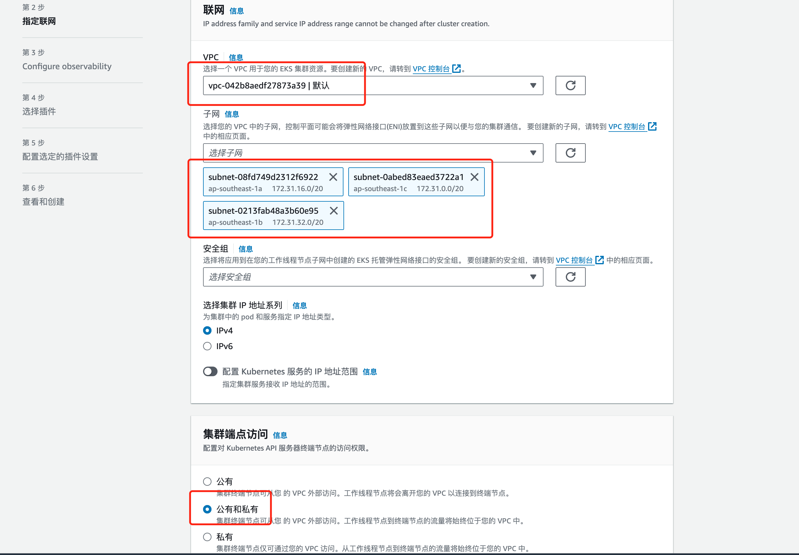

1. 配置可观测性

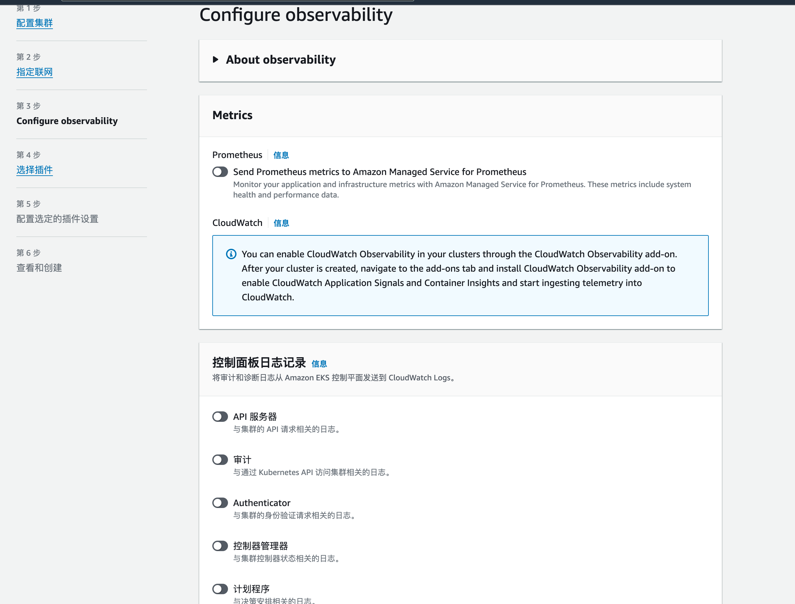

1. 选择插件（默认配置），点击下一步

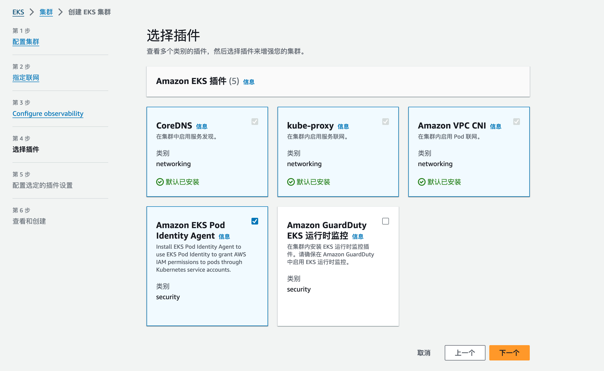

1. 点击创建集群，等待 EKS 创建

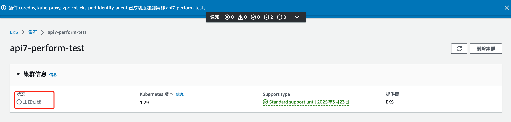

### 添加 Node

#### 创建 Key pair（选做）

在 node 中配置了 Key Pair 就可以直接登录 node。如果已经有 Key Pair 的话，可以跳过创建 Key pair 这一步。

1. 在 AWS 中控台选择“EC2”，进入 EC2 界面，点击左边的“Key Pairs”，在右边点击“Create key pair”

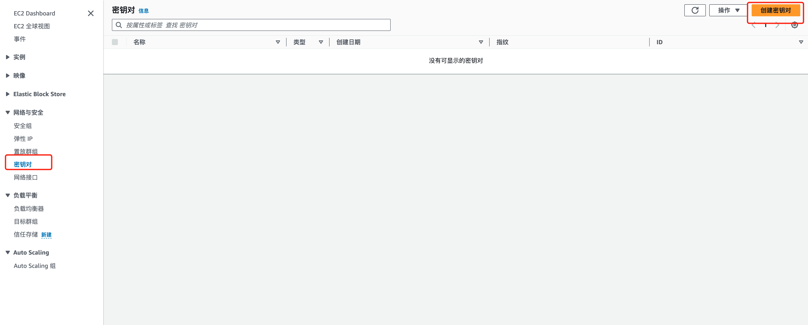

1. 添加名称

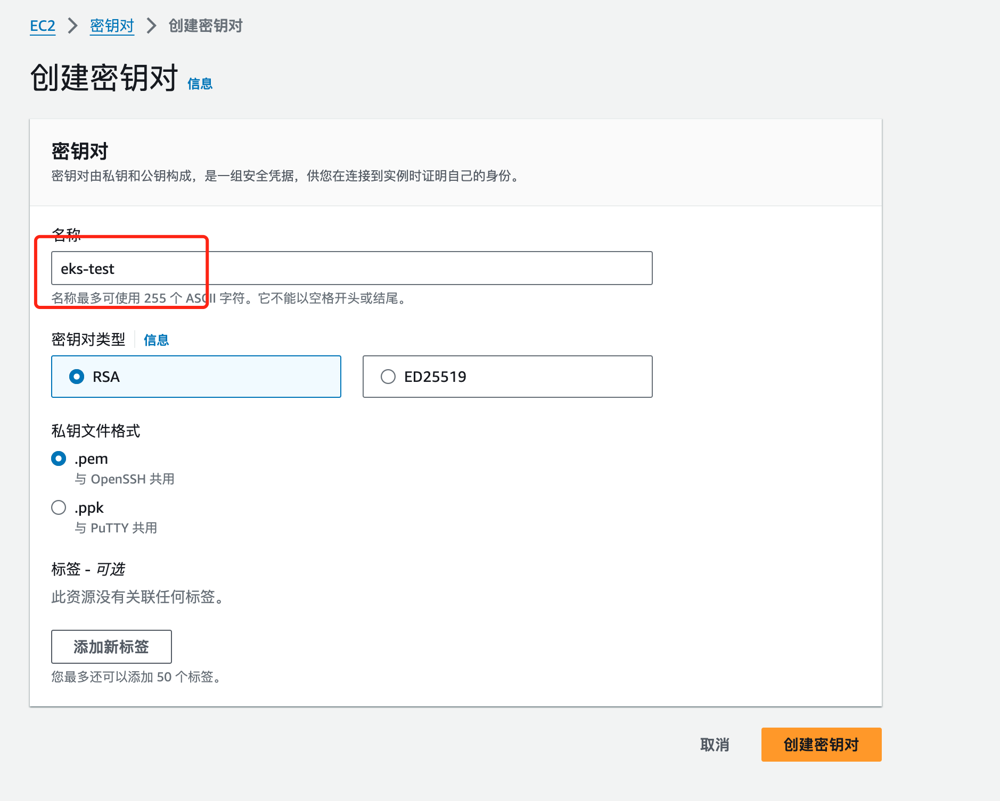

1. 创建密钥对，这时浏览器会自动下载 key pair，这个要保存好，方便之后使用命令登陆 node

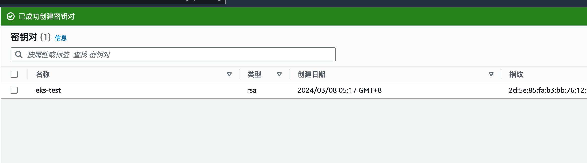

#### 创建 Node group

我们需要添加 3 个节点组，分别在不同的节点组部署 API7 EE，NGINX 上游，wrk2。

**注意：**如果之前没有创建过 EKS Node Role 需要先创建，步骤类似 EKS 创建集群服务角色的过程。可以参考文档：[https://docs.aws.amazon.com/zh_cn/eks/latest/userguide/create-node-role.html](https://docs.aws.amazon.com/zh_cn/eks/latest/userguide/create-node-role.html)

1. 选择“计算”，点击添加“节点组”

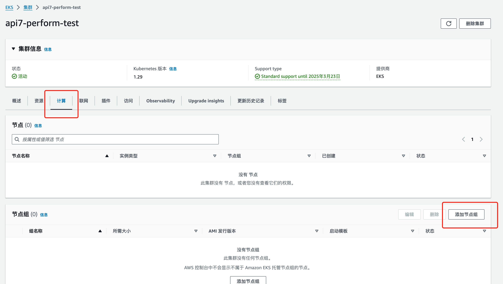

1. 配置节点组

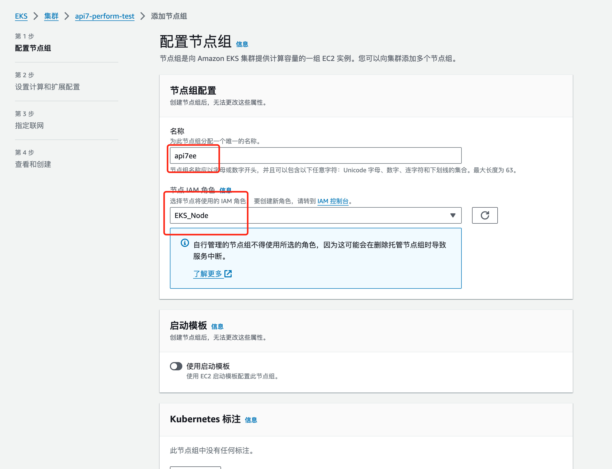

1. 这里我们选择 c5.2xlarge 进行测试，测试过程使用单节点。

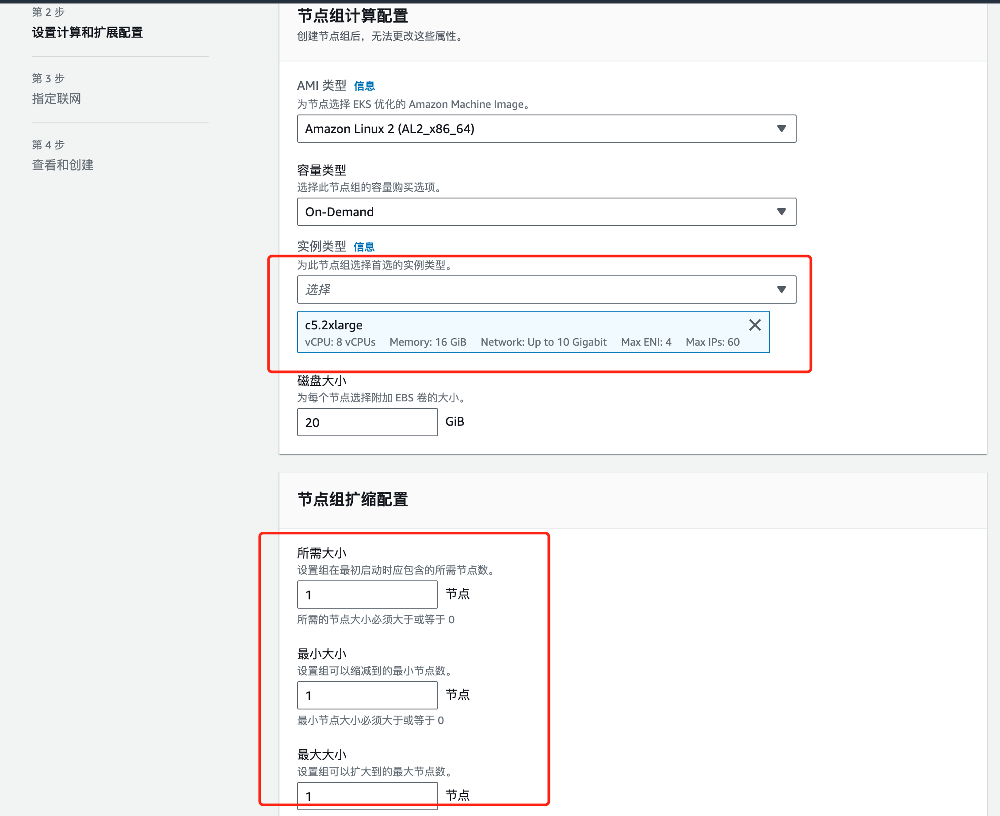

1. 配置网络，这里我们为了方便登陆到 node 中，开启了节点远程访问控制权限，不需要可以不开启。

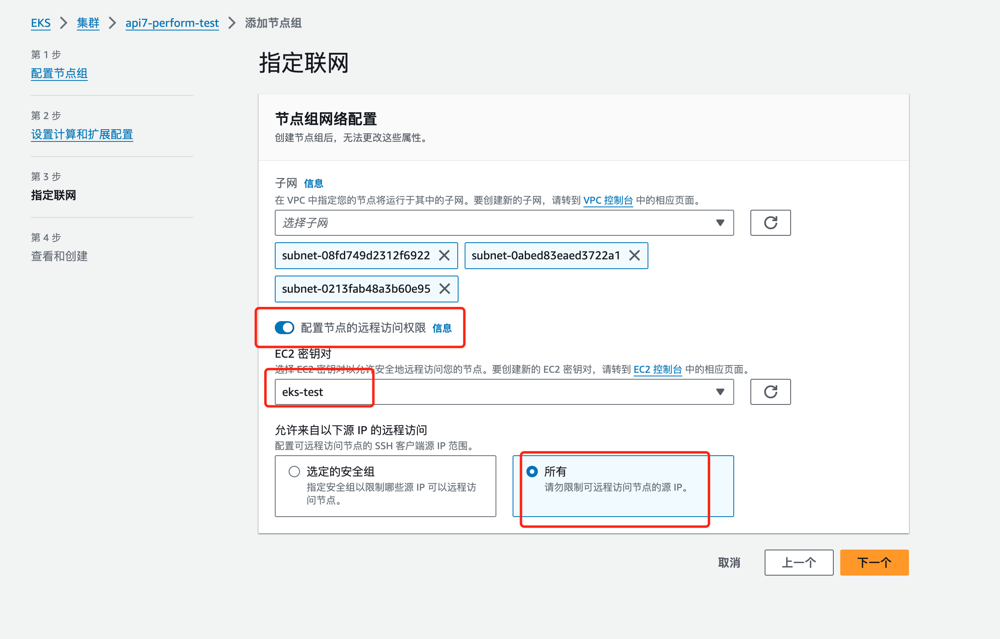

1. 根据上面的步骤，我们需要创建 3 个节点，名字分别为 api7ee，upstream，wrk2 等待创建完成。

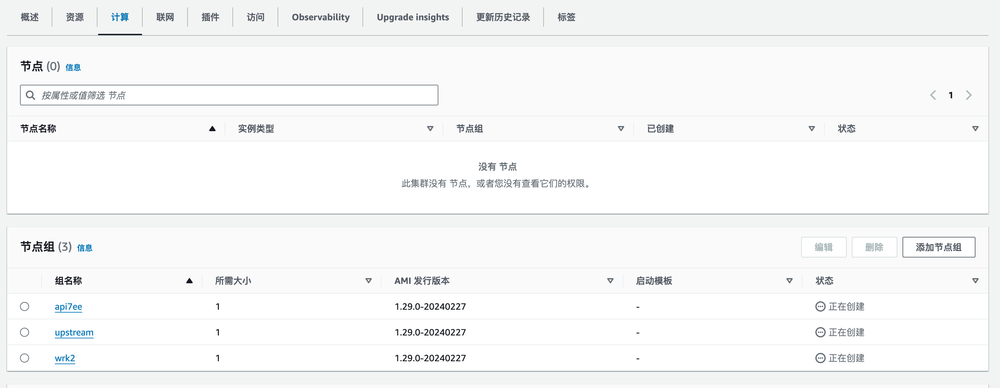

#### 使用 aws cli 配置 kubectl config

1. 通过向 `kubectl` `config` 文件添加新上下文来启用 `kubectl` 与我们创建的集群通信。

具体细节参考文档：[https://docs.aws.amazon.com/zh_cn/eks/latest/userguide/create-cluster.html](https://docs.aws.amazon.com/zh_cn/eks/latest/userguide/create-cluster.html)

```shell
aws eks update-kubeconfig --region region-code --name my-cluster
```

1. 执行 `kubectl get svc` 验证成功与集群的通信，输出如下

```shell
NAME         TYPE        CLUSTER-IP   EXTERNAL-IP   PORT(S)   AGE
kubernetes   ClusterIP   10.100.0.1   <none>        443/TCP   39m
```

#### 为 Node_ _打 label

我们分别为 4 个不同的 Node 打上对应的 label，方便之后的部署

```shell
kubectl label nodes <your-node-name> <label_key=label_value>

# example
kubectl label nodes <your-node1-name> nodeName=api7ee
kubectl label nodes <your-node2-name> nodeName=upstream
kubectl label nodes <your-node3-name> nodeName=wrk2
kubectl label nodes <your-node3-name> nodeName=gateway
```

## 安装过程

### 安装 API7 EE v3.2.8.1

#### 控制面安装

1. 创建一个新的 namespace，之后所有的资源都在同一个 namespace 中管理

```shell
kubectl create namespace api7
```

1. 使用 helm 安装 API7 EE CP

```shell
helm repo add api7 https://charts.api7.ai            
helm repo add apisix https://charts.apiseven.com
helm repo update
# 为安装 api7ee 指定 Node (之前我们为 Node 设置的 label)
helm install api7ee3 api7/api7ee3 --version 0.10.0  --set dashboard.image.tag=v3.2.8.1-0307 --set dp_manager.image.tag=v3.2.8.1 --set nodeSelector."nodeName"=api7ee --set postgresql.primary.nodeSelector."nodeName"=api7ee --set prometheus.server.nodeSelector."nodeName"=api7ee --set postgresql.primary.persistence.enabled=false --set prometheus.server.persistence.enabled=false -n api7
```

1. 检查部署情况

```shell
kubectl get svc -owide -l app.kubernetes.io/name=api7ee3 -n api7

NAME                 TYPE        CLUSTER-IP      EXTERNAL-IP   PORT(S)             AGE   SELECTOR
api7ee3-dashboard    ClusterIP   10.100.25.236   <none>        7080/TCP            18s   app.kubernetes.io/component=dashboard,app.kubernetes.io/instance=api7ee3,app.kubernetes.io/name=api7ee3
api7ee3-dp-manager   ClusterIP   10.100.239.32   <none>        7900/TCP,7943/TCP   18s   app.kubernetes.io/component=dp-manager,app.kubernetes.io/instance=api7ee3,app.kubernetes.io/name=api7ee3
```

1. 将端口转发到本机，登陆控制台并上传 license

```shell
kubectl -n api7 port-forward svc/api7ee3-dashboard 7080:7080
```

License 试用申请地址：https://api7.ai/try?product=enterprise

1. 在控制台配置控制面地址：http://api7ee3-dp-manager:7900

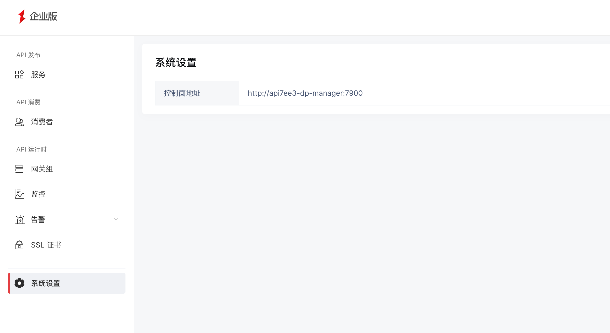

#### 禁用 prometheus 插件

控制面默认会为网关组启用 prometheus 插件，进行性能测试时，我们需要将它禁用掉。

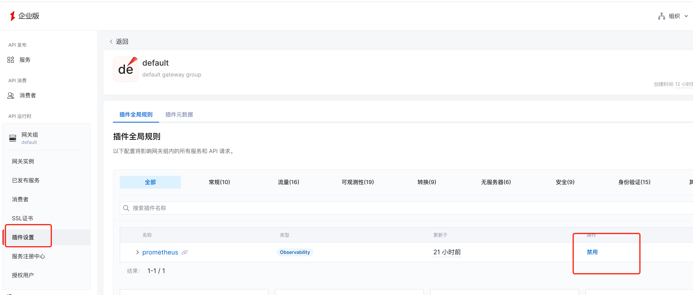

#### 数据面安装

1. 点击进入网关组中


1. 点击新增网关实例按钮

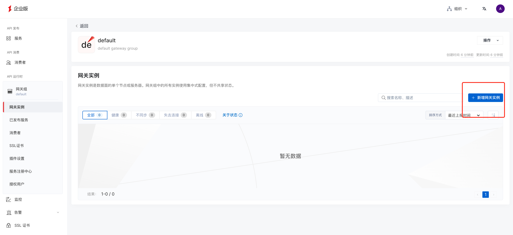

1. 选择 Kubernetes 方式添加，配置命名空间，生成安装脚本并运行

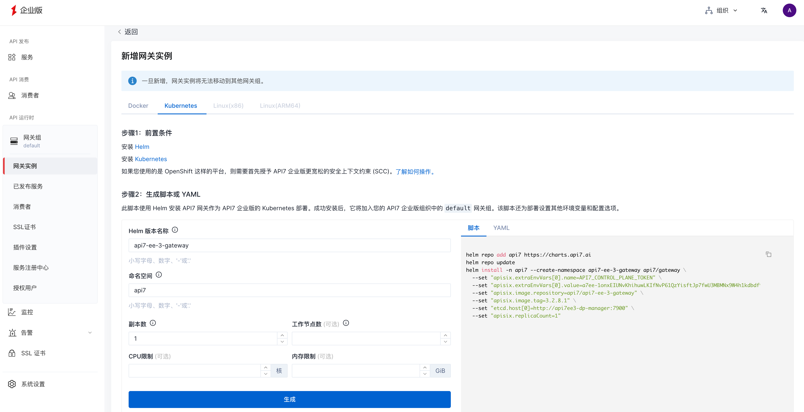

注意我们先修改 API7 Gateway 的 worker_process 数为 1，并指定安装的 Node

```shell
helm install -n api7 --create-namespace api7-ee-3-gateway api7/gateway \
  --set "apisix.extraEnvVars[0].name=API7_CONTROL_PLANE_TOKEN" \
  --set "apisix.extraEnvVars[0].value=a7ee-1onxEIUNvKhihuwLKIfNvP61QzYisftJp7fwU3MBMNx9W4h1kdbdf9031a24d7448da69b6120a526f902" \
  --set "apisix.image.repository=api7/api7-ee-3-gateway" \
  --set "apisix.image.tag=3.2.8.1" \
  --set "etcd.host[0]=http://api7ee3-dp-manager:7900" \
  --set "apisix.replicaCount=1" \
  --set "nginx.workerProcesses"=1 \
  --set apisix.nodeSelector.nodeName=gateway
```

### 安装 NGINX 上游

1. 创建 nginx-upstream.yaml 文件

```yaml
---
_# nginx conf configmap_
apiVersion: v1
kind: ConfigMap
metadata:
  name: nginx-config
  namespace: api7
data:
  nginx.conf: _|_
    master_process on;

    worker_processes 1;

    error_log logs/error.log warn;
    pid logs/nginx.pid;

    events {
        worker_connections 4096;
    }

    http {
        resolver ipv6=off 8.8.8.8;

        #access_log logs/access.log;
        access_log off;
        server_tokens off;
        keepalive_requests 10000000;

        server {
            listen 1980;
            server_name _;

            location / {
                proxy_set_header Connection "";
                return 200 "hello world\n";
            }
        }
    }
---
_# nginx deployment_
apiVersion: apps/v1
kind: Deployment
metadata:
  name: nginx-deployment
  namespace: api7
spec:
  replicas: 1
  selector:
    matchLabels:
      app: nginx
  template:
    metadata:
      labels:
        app: nginx
    spec:
      containers:
      - name: nginx
        image: nginx
        volumeMounts:
        - name: nginx-config-volume
          mountPath: /etc/nginx/nginx.conf
          subPath: nginx.conf
      nodeSelector:
        nodeName: upstream
      volumes:
      - name: nginx-config-volume
        configMap:
          name: nginx-config
---
```

1. 部署 nginx 上游

```shell
kubectl apply -f nginx-upstream.yaml
```

### 安装 wrk2

创建 wrk2.yaml 文件，并运行 kubectl apply -f wrk2.yaml

```yaml
# wrk2 deployment_
_apiVersion: apps/v1_
_kind: Deployment_
_metadata:_
_  name: wrk2-deployment_
_  namespace: api7_
_spec:_
_  replicas: 1_
_  selector:_
_    matchLabels:_
_      app: wrk2_
_  template:_
_    metadata:_
_      labels:_
_        app: wrk2_
_    spec:_
_      containers:_
_      - name: wrk2_
_        image: bootjp/wrk2_
_      nodeSelector:_
_        nodeName: wrk2_
_
```

## 测试过程

### 场景 1：单路由无插件

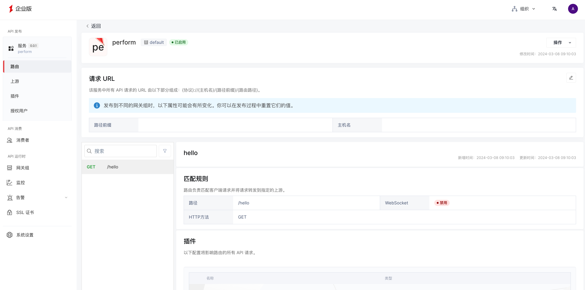

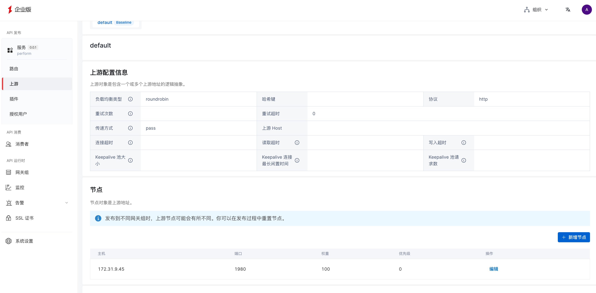

### 场景 2：单路由开启 limit-count

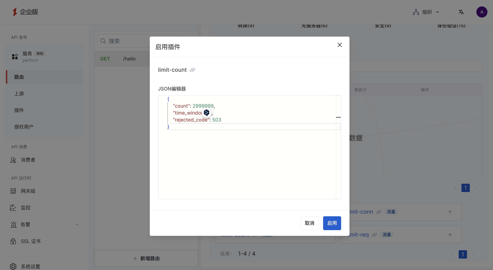

### 场景 3：单路由同时开启 key-auth 和 limit-count

#### Consumer 配置

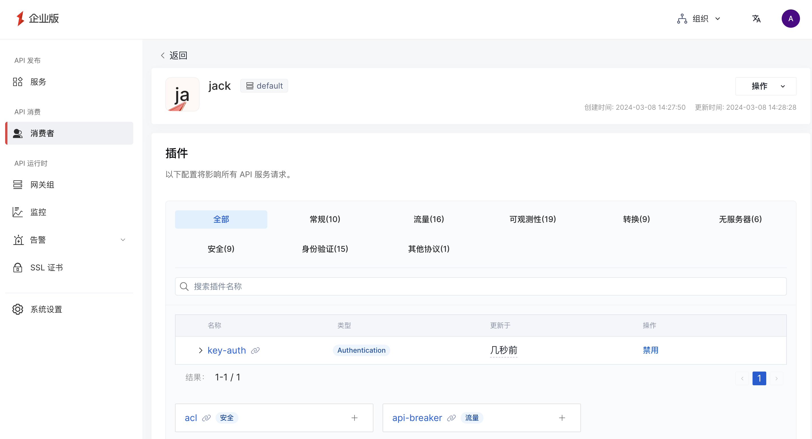

#### 路由配置

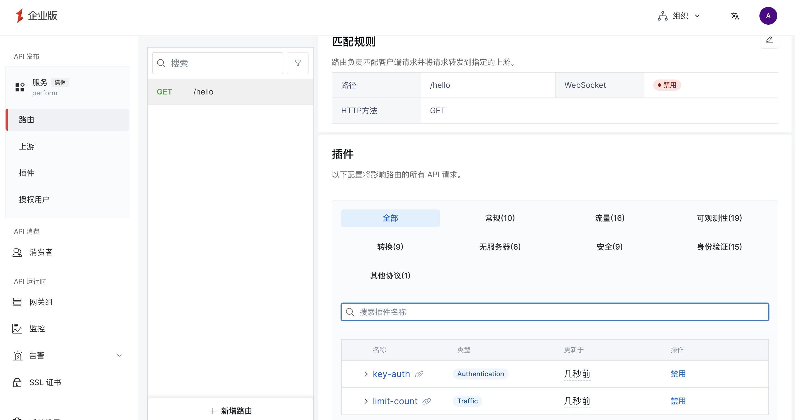

### 场景 4：单路由开启 key-auth

移除 limit-count 插件。

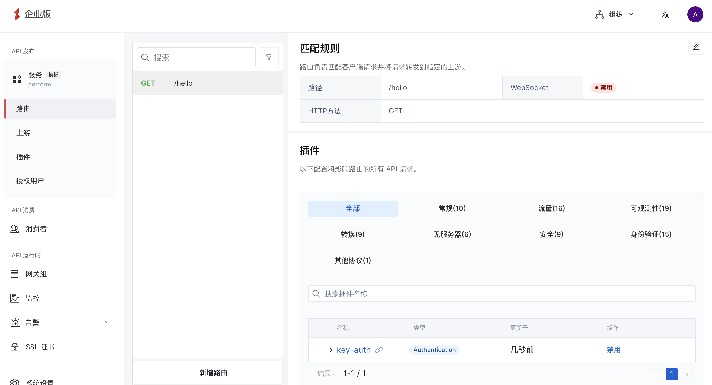

