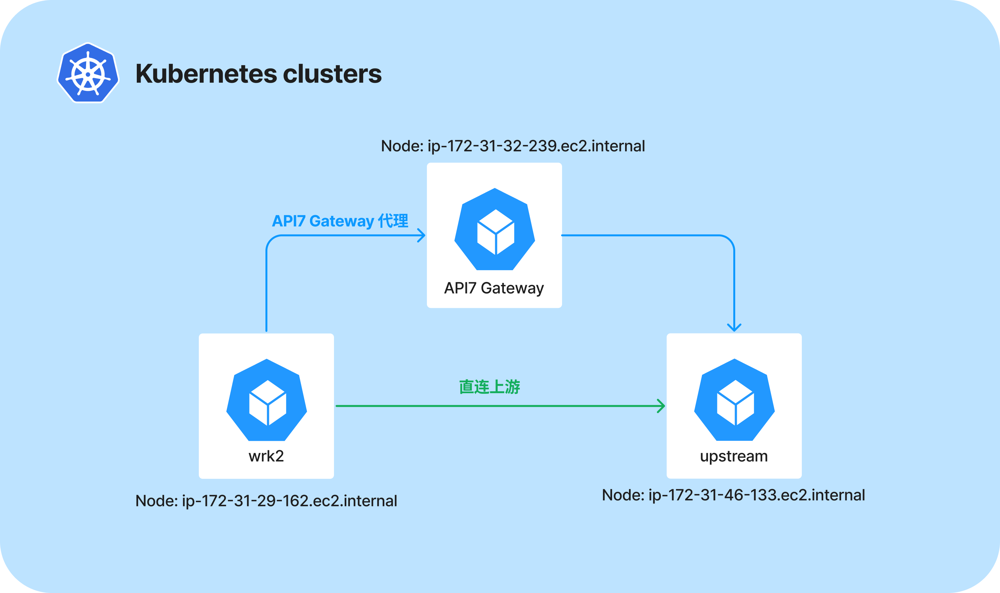

import Tabs from '@theme/Tabs';
import TabItem from '@theme/TabItem';

## 测试方法

- **环境**：AWS 基础设施上的 Kubernetes 环境。
- **测试场景**：
  1. 未启用任何插件；
  2. 只启用 key-auth 身份认证插件；
  3. 只启用 limit-count 限流限速插件；
  4. 同时启用 key-auth 和 limit-count 插件；
- **路由和消费者**：
  1. 单条路由和单个消费者；
  2. 100 条路由和 100 个消费者；
- **测试数据收集方式**：每个测试用例运行 5 次，每次持续 2 分钟。统计的结果为 5 次测试结果的平均值。

## 性能基准测试结果

<Tabs>
  <TabItem value="AWS" label="AWS EKS" default>

|     测试案例                              | 路由/消费者数量| **QPS**    | **Latency（ms）** | 
| :--------------------------------- | :-------------------------------- | :----------------------------- | :----------------------------- |
| 未启用任何插件                        | 1 条路由，0 个消费者 | 167,019.37                         | 5.84                      | 
| 未启用任何插件                        | 100 条路由，0 个消费者 | 162,753.17                         | 5.99                      |
| 只启用 limit-count 限流限速插件           | 1 条路由，0 个消费者 | 145,370.10                         | 6.65                      | 
| 只启用 limit-count 限流限速插件         | 100 条路由，0 个消费者   | 143,108.40                         | 6.78                      |
| 只启用 key-auth 身份认证插件              | 1 条路由，1 个消费者 | 147,869.49                         | 6.68                      | 
| 只启用 key-auth 身份认证插件             | 100 条路由，100 个消费者  | 145,070.93                         | 6.74                      | 
| 同时启用 key-auth 和 limit-count 插件 | 1 条路由，1 个消费者 | 136,725.47                          | 7.23                      | 
| 同时启用 key-auth 和 limit-count 插件 | 100 条路由，100 个消费者 | 133,782.95                          | 7.31                      |

  </TabItem>
</Tabs>

## 测试环境

本测试报告在 AWS EKS 中搭建环境来运行这些测试，请确保 API7 Gateway、NGINX Upstream 和 [wrk2](https://github.com/giltene/wrk2) 分别位于自己的节点上，并统一使用 `c5.4xlarge` 的 EC2 实例来进行安装，避免产生资源争夺的情况。

压测过程推荐使用 `top` 命令观察 API7 Gateway 和 NGINX Upstream 服务器的进程资源占用状况，确保每次压测达到了 Gateway 的瓶颈。以下是用到的主要服务的详细信息：

| 对象         | 详细信息                  |
| ------------ | ------------------------- |
| Node 配置    | Amazon Linux2(AL2_x86_64) |
| Kubernetes   | 1.29                      |
| API7 Gateway | 3.2.11.0                   |
| 上游服务     | nginx/1.25.4              |
| 压测工具     | wrk2                      |

## 部署拓扑

1. 使用 wrk2 直接测试上游的目的是获取一个基线值，一方面确保 Upstream 性能是否是极限值，另一方面是为了给之后测试 API7 Gateway 做数据准确性对比。
2. 其余的场景我们均通过 API7 Gateway 代理来测试。

## 测试配置

对于这些测试，我们更改了工作进程的数量，以匹配运行 API7 Gateway 的节点的可用核心数量（16 个 **vCPU**）。除此更改外，没有进行其他调整。

## 更多信息

- [建立性能基准测试报告](./benchmark.md)：了解如何优化 API7 Gateway 性能。
- [在 AWS EKS 性能测试指南](./aws-eks.md)：查看如何在 AWS EKS 上建立性能基准测试报告。
